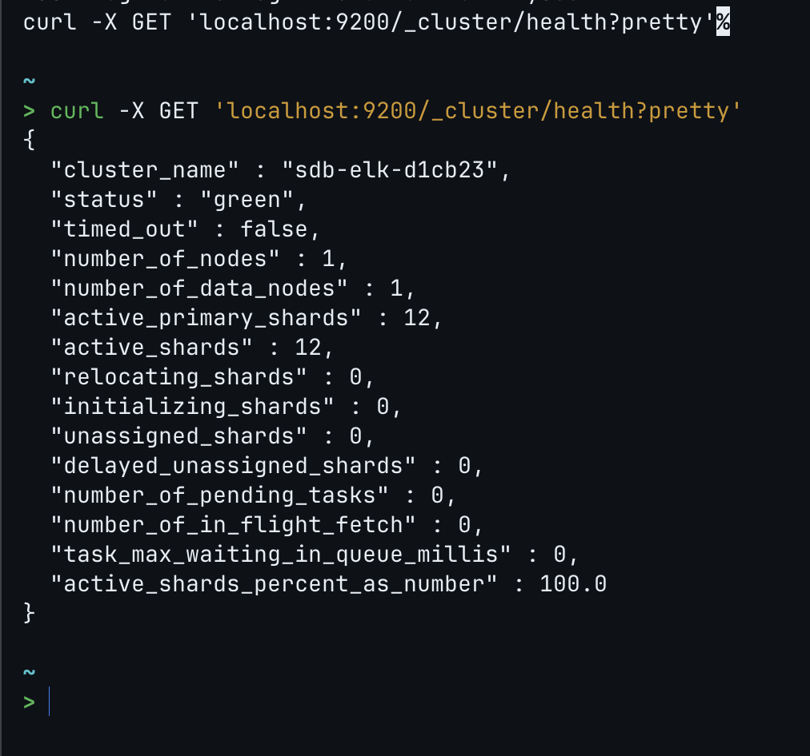
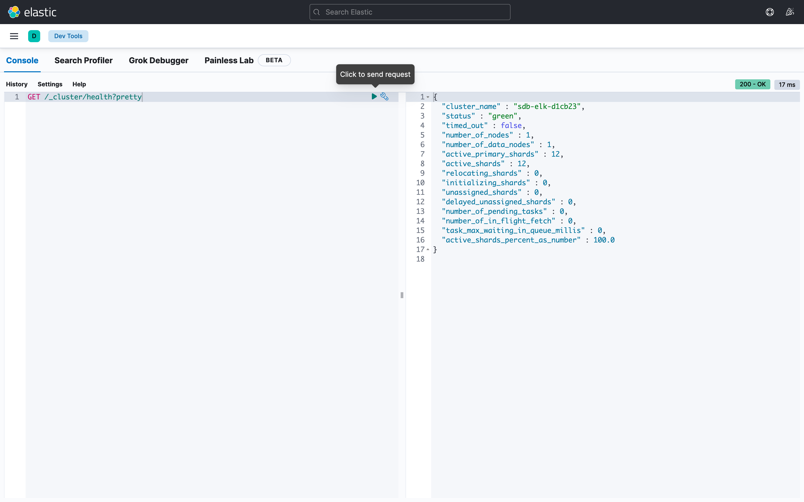
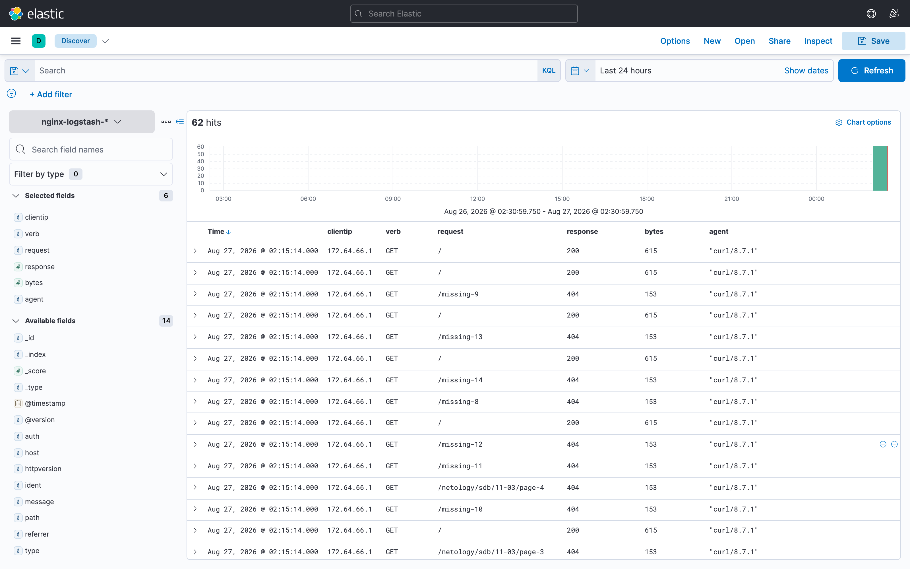
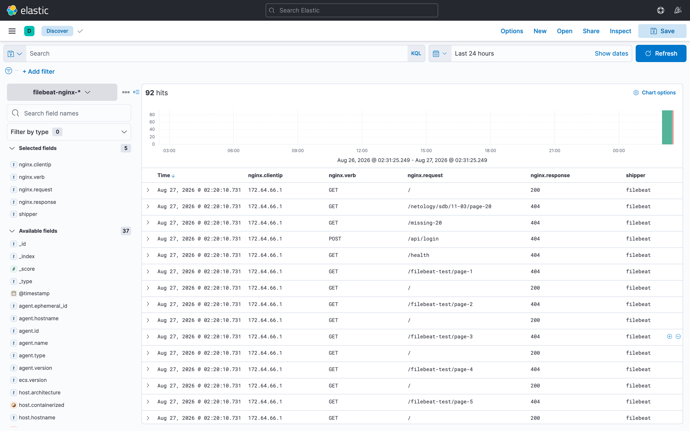
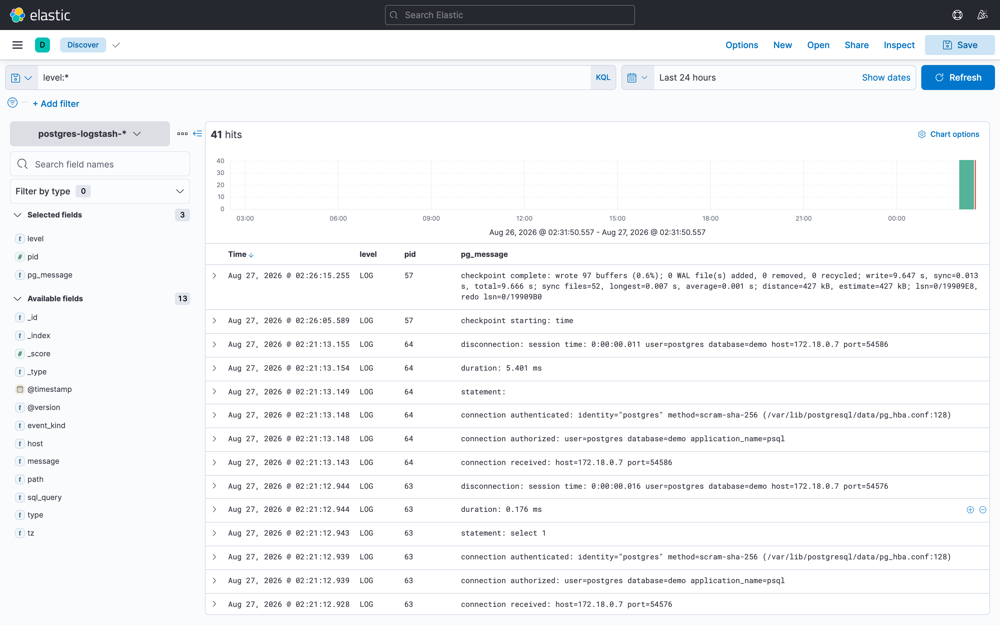

# Домашнее задание к занятию «ELK»

**Выполнил:** Маньков Иван

---

## Стенд

Весь стек развёрнут локально в Docker (Elastic Stack 7.17.28, arm64):

| Компонент | Версия | Порт | Роль |
|---|---|---|---|
| Elasticsearch | 7.17.28 | 9200 | хранение и индексация |
| Kibana | 7.17.28 | 5601 | визуализация |
| Logstash | 7.17.28 | — | доставка логов (задания 3 и 5*) |
| Filebeat | 7.17.28 | — | доставка логов (задание 4) |
| Nginx | 1.27-alpine | 8080 | источник access-логов |
| PostgreSQL | 16-alpine | — | источник логов для задания 5* |

Полная конфигурация стенда лежит в репозитории:

- [`docker-compose.yaml`](docker-compose.yaml) — весь стек;
- [`logstash/pipeline/nginx.conf`](logstash/pipeline/nginx.conf) — пайплайн Nginx → Elasticsearch;
- [`logstash/pipeline/postgres.conf`](logstash/pipeline/postgres.conf) — пайплайн PostgreSQL → Elasticsearch;
- [`filebeat/filebeat.yml`](filebeat/filebeat.yml) — конфигурация Filebeat.

Запуск:

```bash
docker compose up -d elasticsearch kibana nginx logstash
```

---

### Задание 1. Elasticsearch

Elasticsearch запущен в контейнере, параметр `cluster.name` задан случайным значением через переменную окружения:

```yaml
  elasticsearch:
    image: docker.elastic.co/elasticsearch/elasticsearch:7.17.28
    environment:
      - cluster.name=sdb-elk-d1cb23        # случайное имя вместо стандартного elasticsearch
      - node.name=es-node-01
      - discovery.type=single-node
      - xpack.security.enabled=false
      - "ES_JAVA_OPTS=-Xms1g -Xmx1g"
```

Имя сгенерировано командой `openssl rand -hex 3` → `sdb-elk-d1cb23`.

Проверка:

```bash
curl -X GET 'localhost:9200/_cluster/health?pretty'
```

Вывод команды:

```json
{
  "cluster_name" : "sdb-elk-d1cb23",
  "status" : "green",
  "timed_out" : false,
  "number_of_nodes" : 1,
  "number_of_data_nodes" : 1,
  "active_primary_shards" : 10,
  "active_shards" : 10,
  "relocating_shards" : 0,
  "initializing_shards" : 0,
  "unassigned_shards" : 0,
  "delayed_unassigned_shards" : 0,
  "number_of_pending_tasks" : 0,
  "number_of_in_flight_fetch" : 0,
  "task_max_waiting_in_queue_millis" : 0,
  "active_shards_percent_as_number" : 100.0
}
```

В поле `cluster_name` видно нестандартное имя кластера **sdb-elk-d1cb23**.



---

### Задание 2. Kibana

Kibana запущена и подключена к Elasticsearch:

```yaml
  kibana:
    image: docker.elastic.co/kibana/kibana:7.17.28
    environment:
      - ELASTICSEARCH_HOSTS=http://elasticsearch:9200
      - I18N_LOCALE=ru-RU
    ports:
      - "5601:5601"
```

Интерфейс доступен на `http://localhost:5601`. В консоли Dev Tools выполнен запрос `GET /_cluster/health?pretty` — Kibana получает от Elasticsearch тот же ответ с именем кластера `sdb-elk-d1cb23`, то есть связка Kibana ↔ Elasticsearch работает.



---

### Задание 3. Logstash

**Важный нюанс.** В официальном образе `nginx` файл `/var/log/nginx/access.log` — это симлинк на `/dev/stdout`, поэтому Logstash не может читать его как файл. Симлинк удаляется при старте контейнера, после чего nginx пишет обычный файл в том, общий с Logstash:

```yaml
  nginx:
    image: nginx:1.27-alpine
    command: /bin/sh -c "rm -f /var/log/nginx/access.log /var/log/nginx/error.log && nginx -g 'daemon off;'"
    ports:
      - "8080:80"
    volumes:
      - nginx-logs:/var/log/nginx
```

Пайплайн Logstash ([`logstash/pipeline/nginx.conf`](logstash/pipeline/nginx.conf)) читает этот файл, разбирает строку grok-шаблоном `COMBINEDAPACHELOG` и пишет в индекс `nginx-logstash-*`:

```ruby
input {
  file {
    path => "/var/log/nginx/access.log"
    start_position => "beginning"
    sincedb_path => "/dev/null"
    type => "nginx-access"
  }
}

filter {
  if [type] == "nginx-access" {
    grok  { match => { "message" => "%{COMBINEDAPACHELOG}" } }
    date  { match => [ "timestamp", "dd/MMM/yyyy:HH:mm:ss Z" ] target => "@timestamp" }
    mutate {
      convert => { "response" => "integer" "bytes" => "integer" }
      remove_field => [ "timestamp" ]
    }
  }
}

output {
  if [type] == "nginx-access" {
    elasticsearch {
      hosts => ["http://elasticsearch:9200"]
      index => "nginx-logstash-%{+YYYY.MM.dd}"
    }
  }
}
```

Генерация трафика и проверка индекса:

```bash
for i in $(seq 1 20); do
  curl -s -o /dev/null "http://localhost:8080/netology/sdb/11-03/page-$i"
  curl -s -o /dev/null "http://localhost:8080/missing-$i"
done

curl -s "localhost:9200/_cat/indices/nginx-logstash-*?v"
# health status index                     docs.count store.size
# green  open   nginx-logstash-2026.08.26         62      108kb
```

Пример документа в Elasticsearch — grok разложил строку по полям:

```json
{
  "clientip": "172.64.66.1",
  "verb": "GET",
  "request": "/",
  "httpversion": "1.1",
  "response": 200,
  "bytes": 615,
  "agent": "\"curl/8.7.1\"",
  "type": "nginx-access",
  "path": "/var/log/nginx/access.log",
  "@timestamp": "2026-08-26T23:15:14.000Z"
}
```

В Kibana создан index pattern `nginx-logstash-*`, логи Nginx видны в Discover:



---

### Задание 4. Filebeat

Поставка логов переключена с Logstash на Filebeat:

```bash
docker compose stop logstash                      # выключаем доставку через Logstash
docker compose --profile beats up -d filebeat     # включаем доставку через Filebeat
```

Конфигурация [`filebeat/filebeat.yml`](filebeat/filebeat.yml) — тот же файл лога, разбор процессором `dissect`, свой индекс `filebeat-nginx-*`:

```yaml
filebeat.inputs:
  - type: log
    enabled: true
    paths:
      - /var/log/nginx/access.log
    fields:
      log_source: nginx
      shipper: filebeat
    fields_under_root: true

processors:
  - dissect:
      tokenizer: '%{clientip} %{ident} %{auth} [%{nginx_timestamp}] "%{verb} %{request} HTTP/%{httpversion}" %{response} %{bytes} "%{referrer}" "%{agent}"'
      field: "message"
      target_prefix: "nginx"
  - add_host_metadata: ~

setup.ilm.enabled: false
setup.template.name: "filebeat-nginx"
setup.template.pattern: "filebeat-nginx-*"

output.elasticsearch:
  hosts: ["http://elasticsearch:9200"]
  index: "filebeat-nginx-%{+yyyy.MM.dd}"
```

**Грабли, на которые я наступил:** сначала поле называлось `service: nginx`, и Elasticsearch отбивал все события с `status=400` («dropping event»), потому что в ECS-шаблоне `service` — объект, а не строка. После переименования в `log_source` события пошли.

Проверка:

```bash
curl -s "localhost:9200/_cat/indices/filebeat-*?v"
# health status index                     docs.count store.size
# green  open   filebeat-nginx-2026.08.26         92     44.4kb
```

Пример документа, доставленного Filebeat (`shipper: filebeat`, `agent.type: filebeat`):

```json
{
  "@timestamp": "2026-08-26T23:20:10.730Z",
  "shipper": "filebeat",
  "log_source": "nginx",
  "message": "172.64.66.1 - - [26/Aug/2026:23:15:14 +0000] \"GET / HTTP/1.1\" 200 615 \"-\" \"curl/8.7.1\" \"-\"",
  "log": { "file": { "path": "/var/log/nginx/access.log" } },
  "input": { "type": "log" },
  "agent": { "type": "filebeat", "version": "7.17.28" },
  "ecs": { "version": "1.12.0" }
}
```

В Kibana создан index pattern `filebeat-nginx-*`, логи Nginx приходят уже через Filebeat:



---

### Задание 5*. Доставка данных другого сервиса

**Отправляется лог PostgreSQL 16** — журнал СУБД со всеми SQL-запросами (`log_statement=all`), подключениями и отключениями клиентов.

PostgreSQL настроен писать лог на файловую систему, том с данными подключён к Logstash на чтение:

```yaml
  postgres:
    image: postgres:16-alpine
    volumes:
      - pg-data:/var/lib/postgresql/data
    command:
      - postgres
      - -c
      - logging_collector=on
      - -c
      - log_directory=/var/lib/postgresql/data/log
      - -c
      - log_filename=postgresql.log
      - -c
      - log_statement=all
      - -c
      - log_min_duration_statement=0
      - -c
      - log_connections=on
      - -c
      - log_disconnections=on
```

Пайплайн [`logstash/pipeline/postgres.conf`](logstash/pipeline/postgres.conf) парсит формат `%m [%p] LEVEL:  сообщение` и дополнительно выделяет сам SQL-запрос в поле `sql_query`:

```ruby
input {
  file {
    path => "/var/lib/postgresql/data/log/postgresql*.log"
    start_position => "beginning"
    sincedb_path => "/dev/null"
    type => "postgresql"
  }
}

filter {
  if [type] == "postgresql" {
    grok {
      match => { "message" => "%{TIMESTAMP_ISO8601:log_timestamp} %{WORD:tz} \[%{POSINT:pid}\](?: \[%{DATA:session}\])? %{DATA:level}:  %{GREEDYDATA:pg_message}" }
    }
    date {
      match    => [ "log_timestamp", "yyyy-MM-dd HH:mm:ss.SSS", "yyyy-MM-dd HH:mm:ss" ]
      target   => "@timestamp"
      timezone => "UTC"
    }
    if [pg_message] =~ /^statement:/ {
      mutate { add_field => { "event_kind" => "sql_statement" } }
      grok   { match => { "pg_message" => "statement: %{GREEDYDATA:sql_query}" } }
    }
    mutate { convert => { "pid" => "integer" } remove_field => [ "log_timestamp" ] }
  }
}

output {
  if [type] == "postgresql" {
    elasticsearch {
      hosts => ["http://elasticsearch:9200"]
      index => "postgres-logstash-%{+YYYY.MM.dd}"
    }
  }
}
```

**Ещё одни грабли:** каталог данных PostgreSQL имеет права `0700` и владельца `uid 70`, а Logstash в своём образе работает под `uid 1000` — файл лога был ему недоступен, пайплайн молча не давал документов. Решение — запустить контейнер Logstash под root (`user: "0"`), том при этом смонтирован в режиме `:ro`.

Генерация активности в БД:

```bash
docker run --rm --network elk_default -e PGPASSWORD=netology postgres:16-alpine \
  psql -h postgres -U postgres -d demo -c "
    CREATE TABLE IF NOT EXISTS objects (id serial primary key, name text, city text);
    INSERT INTO objects (name, city) VALUES ('ЖК Северный','Москва'), ('ЖК Речной','Санкт-Петербург');
    SELECT name, city FROM objects ORDER BY id;
    UPDATE objects SET city='Москва' WHERE id=1;"
```

Проверка индекса и разложенных на поля запросов:

```bash
curl -s "localhost:9200/_cat/indices/postgres-logstash-*?v"
# health status index                        docs.count store.size
# green  open   postgres-logstash-2026.08.26         45     89.2kb
```

```json
{ "level": "LOG", "pid": 51, "event_kind": "sql_statement",
  "sql_query": "SELECT 1 FROM pg_database WHERE datname = 'demo' ;" }
```

Лог PostgreSQL в Kibana (index pattern `postgres-logstash-*`, KQL-фильтр `level:*` отсекает строки-продолжения многострочных сообщений). Видны уровни `LOG`, pid процессов, подключения/отключения клиентов и текст SQL-запросов:



---

## Итог

| Задание | Источник | Доставка | Индекс | Документов |
|---|---|---|---|---|
| 3 | Nginx access.log | Logstash | `nginx-logstash-*` | 62 |
| 4 | Nginx access.log | Filebeat | `filebeat-nginx-*` | 92 |
| 5* | PostgreSQL log | Logstash | `postgres-logstash-*` | 45 |
